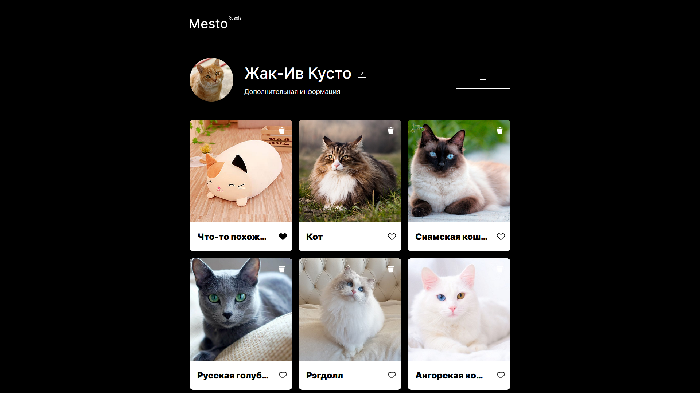

# MESTO

The purpose of this website is to give user opportunity to share his favorite photos with others.

## Functionality of the project

The user can add a new card containing an image and a name, as well as delete an existing one. When the user adds or deletes a card, the changes are reflected in the firebase repository, so all users can see them. The user can also change the profile name, additional information and the profile picture. All forms contain validation to provide users with information about what went wrong.

You can visit website by clicking [this link](https://kanae367.github.io/mesto/)

## The project was made using the following technologies:

- HTML
- CSS
- Flex
- JS
- Firebase

## How to start

Clone the repository using the following command:

`git clone https://github.com/kanae367/mesto.git`
